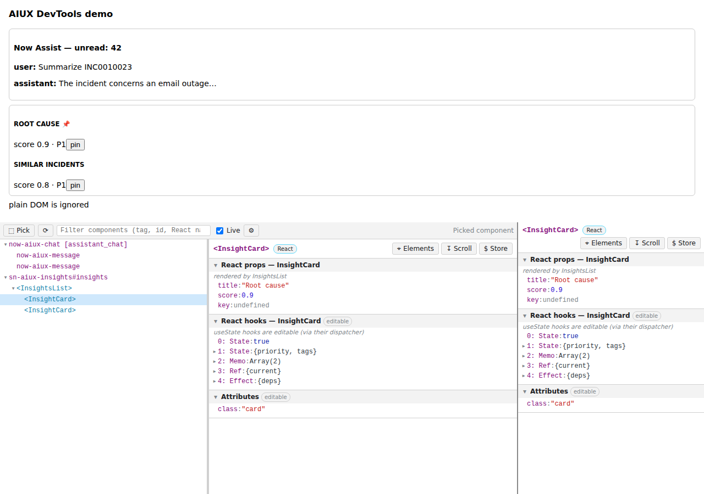

# SN AIUX DevTools

A Chrome DevTools extension for inspecting **ServiceNow AIUX / Next Experience components**: browse the component tree, then view and edit each component's **properties** and **state**, much like the Next Experience Dev Tools.



## Features

- **AIUX panel** (a new DevTools tab)
  - A component tree that walks the light DOM, open **shadow roots** and same-origin **iframes**.
  - **Pick** mode: click any component in the page to select it (Esc cancels).
  - Hovering a tree row highlights that component in the page. You can filter the tree, and use the arrow keys to move through it.
  - **Live** mode polls the selected component and briefly highlights values that change.
- **AIUX Component sidebar** in the Elements panel shows the nearest component for whatever node you select (`$0`).
- For each component it shows:

  | Section | Source | Editable |
  |---|---|---|
  | **Properties** | Declared props: `static properties` / `componentConfig.properties`, `observedAttributes`, and getters/setters on the component class | ✅ assigns `host[prop] = value` (nested edits copy the objects along the path, so frameworks that compare by reference see a change) |
  | **State** | The host's state object (see [State discovery](#state-discovery)) | ✅ through `updateState`/`setState`/`patchState` if one is found next to the state, otherwise by mutating the object in place |
  | **React props / hooks / state** | For AIUX surfaces built with React: the nearest component fiber's props, hook list (State, Memo, Ref, Effect…) and class state | ✅ `useState` hooks (through their dispatcher) and class `setState` |
  | **Attributes** | DOM attributes | ✅ (`null` removes the attribute) |
  | **Host internals** | Every own property of the host element, including non-enumerable and symbol keys | read-only |

- Values are loaded lazily as you expand them. Supported types include objects, arrays, Maps, Sets, Dates, functions, BigInts, Symbols, DOM nodes (click one to jump to it) and circular references.
- Hover over any row to **copy it as JSON** (⧉) or **store it as a console global** (`$aiux1`, `$aiux2`, …). Header buttons reveal the host element in **Elements**, scroll it into view, or store it as a global.
- Light and dark DevTools themes are supported.

## Install (unpacked)

1. Clone this repo.
2. Open `chrome://extensions`, turn on **Developer mode**, click **Load unpacked**, and choose the repository folder (the one containing `manifest.json`).
3. Open a ServiceNow page (e.g. `/now/...` workspaces or Now Assist / AIUX experiences), open DevTools, and select the **AIUX** tab.

The extension asks for **no permissions**. It only runs code in the page when you open DevTools on that page, via `chrome.devtools.inspectedWindow.eval`. Because of that, it also works on instances with custom domains.

## Editing values

Double-click a value in an *editable* section. Type JSON (`42`, `true`, `"text"`, `{"a":1}`). Anything that isn't valid JSON is stored as a plain string. For objects and arrays a multi-line editor opens; press Ctrl/⌘+Enter to apply. Esc cancels.

## Settings (⚙)

- **Component tag pattern.** A regular expression for which custom elements count as components. Default: `^(now|sn|macroponent|uxf|x|aiux|ai|nas|sys|seismic)-`. `x-` covers scoped-app components such as `x-snc-…`.
- **Show every custom element.** Ignore the pattern and list every tag that contains a hyphen.
- **Detect React components.** Show React component boundaries in the tree, along with their props and hooks.
- **Extra state paths.** Paths on the host element to check first when looking for state, e.g. `__myFramework.state` or `store.getState()` (`()` calls the function).

## State discovery

ServiceNow doesn't publish a stable API for reading a component's internal state, so the agent searches the host element for it. The **State** section's note tells you which path was used:

1. Your *extra state paths*.
2. Well-known slots: `state`, `__state`, `_state`, `componentState`, `__component.state`, `__internals.state`, `store.getState()`, `getState()`, …
3. Any own property (including non-enumerable or symbol keys) whose name contains `state`.
4. Any own object property that has a `state`/`_state`/`currentState` object or a `getState()` method.

If nothing is found, open **Host internals** to see where the framework keeps its data, then add that path in Settings.

## Development

```bash
npm install          # Playwright + React (used by the demo fixture)
npm test             # agent unit tests + end-to-end panel/sidebar tests in headless Chromium
npm run lint
npm run demo         # http://localhost:5173/test/harness.html
```

`npm run demo` serves a harness that runs the **real** panel and sidebar against a demo page (`test/fixtures/demo.html`), with `chrome.devtools` mocked. The demo page has custom-element components and a React tree inside a shadow root, so you can work on the UI without a ServiceNow instance.

### Layout

```
manifest.json          MV3 manifest (devtools_page only, no permissions)
devtools/              registers the AIUX panel and the Elements sidebar
agent/agent.js         page-side agent, injected into the inspected page's main world
shared/bridge.js       eval bridge; injects the agent lazily and again after navigation
shared/details.js      properties/state inspector UI (shared by panel and sidebar)
shared/settings.js     settings stored in the extension's localStorage
panel/                 AIUX panel (tree + inspector)
sidebar/               Elements-panel sidebar
test/                  fixture page, chrome.devtools mock, harness, tests
```

The agent's version must match `manifest.json`'s `version`; the tests check this. Bump both together.

## Limitations

- Closed shadow roots and cross-origin iframes can't be inspected.
- State edits made without an updater function change the object in place, so the component may not re-render until something else triggers a render.
- `useReducer` state is read-only, because writing it would require sending a reducer action.
